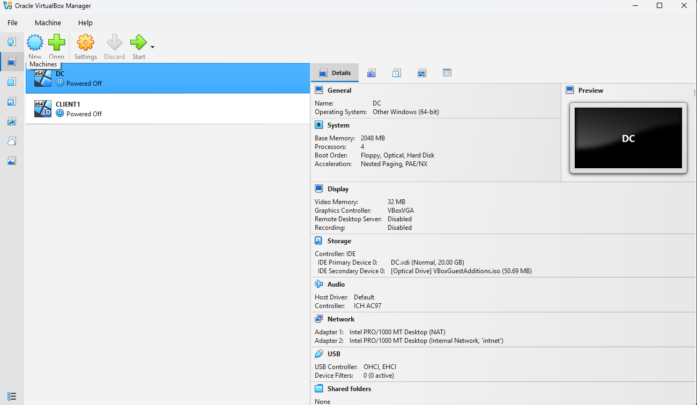
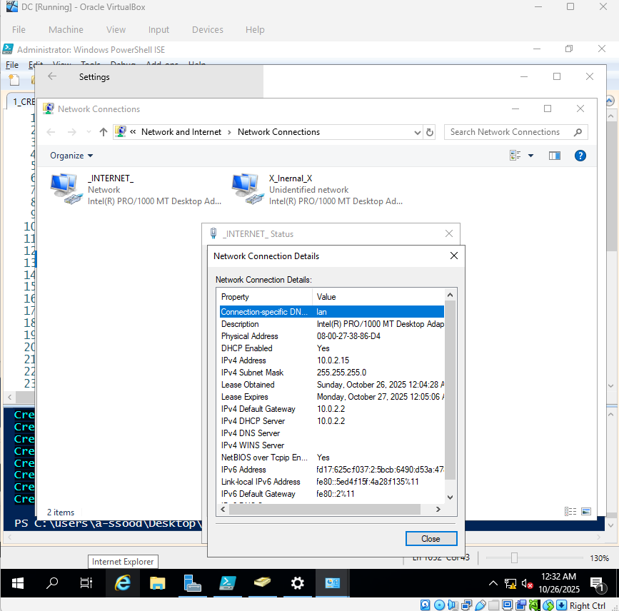
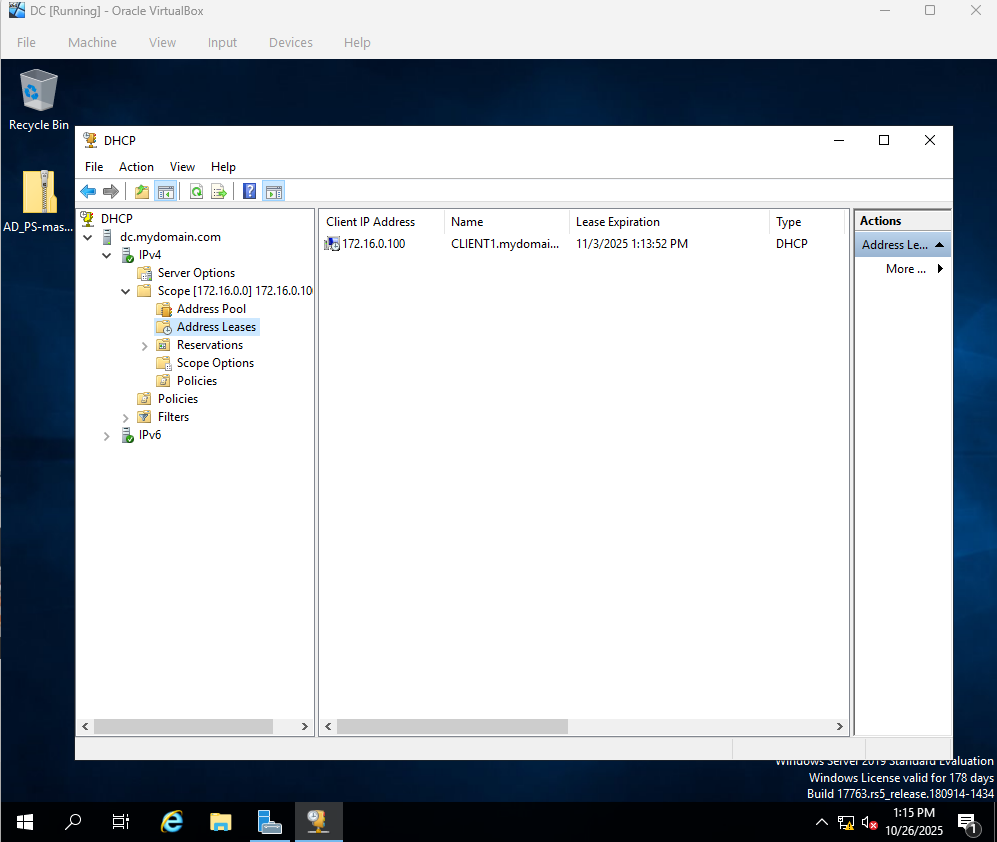
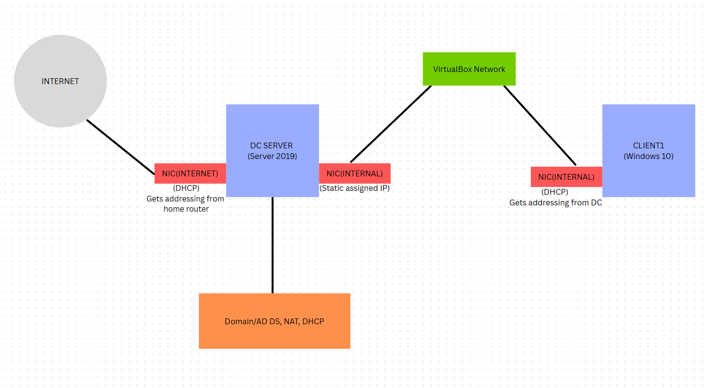
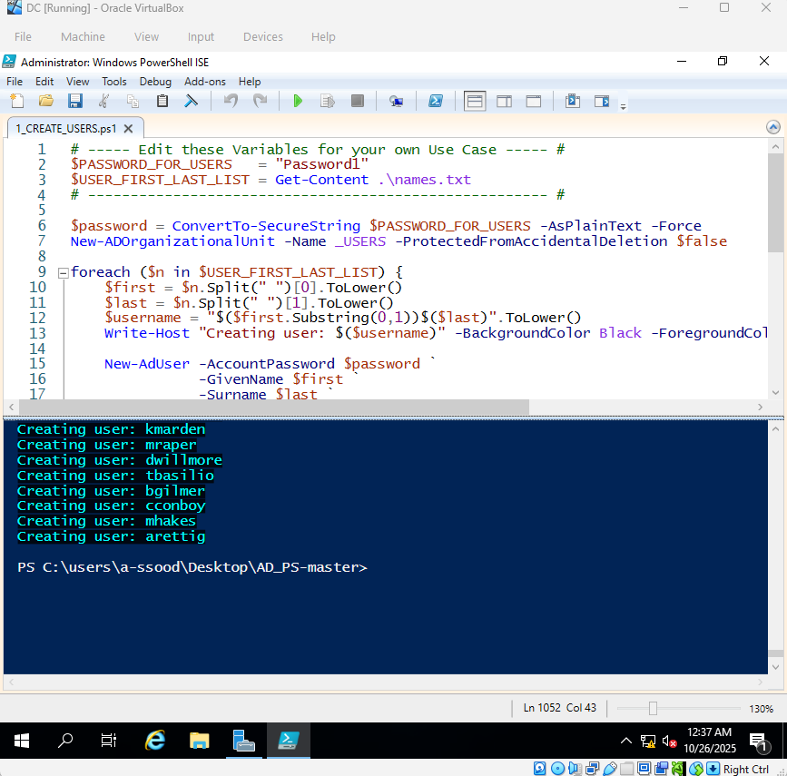
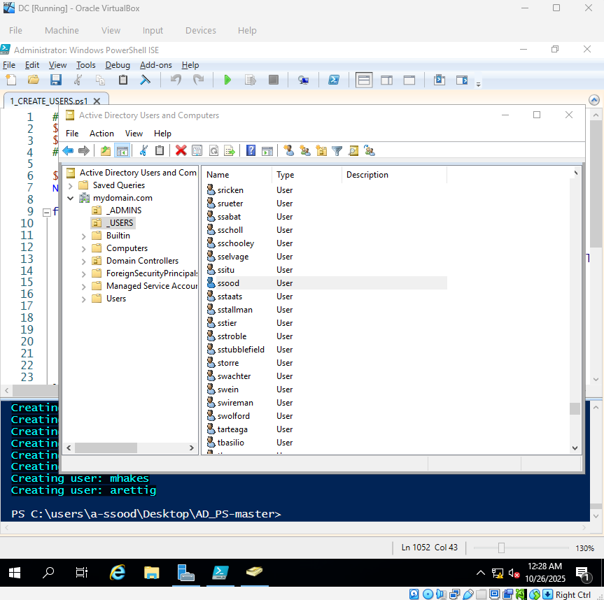

# Active Directory Home Lab 

## Overview

This project demonstrates how to build a basic Active Directory home lab environment using virtualization.

The lab simulates a small enterprise network where a Windows Server 2019 Domain Controller manages a Windows 10 client machine through Active Directory.

The goal of this project was to gain hands on experience with:

- Installing and configuring Active Directory Domain Services (AD DS)
- Managing users within a domain environment
- Configuring DHCP for automatic IP address assignment
- Setting up virtual machine networking
- Automating user creation with PowerShell

This project demonstrates how system administrators configure and manage centralized authentication and user management in a Windows domain environment.

---

## Tools and Technologies Used

- **Oracle VirtualBox** 
- **Windows Server 2019** (Domain Controller)
- **Windows 10** (Client machine)
- **Active Directory Domain Services**
- **PowerShell**
- **DHCP**
- **Virtual Networking**

---

## Lab Environment

Two virtual machines were created using Oracle VirtualBox:

| Virtual Machine | Role |
|----------------|------|
| **DC (Windows Server 2019)** | Domain Controller |
| **Client1 (Windows 10)** | Domain Client |

### Virtual Machines

The Domain Controller was configured with two network interfaces:

- Internet NIC (DHCP from the home router)
- Internal NIC*(static IP used for the internal domain network)

The internal network allowed communication between the Domain Controller and the client machine.

---

## Network Configuration

The Domain Controller managed the internal network using DHCP.

Example configuration:

- Network: **172.16.0.0/24**
- Domain Controller IP: **172.16.0.1**
- DHCP Range: **172.16.0.100 – 172.16.0.200**

### Network Adapter Configuration

### DHCP Configuration

The DHCP server automatically assigned IP addresses to domain clients connected to the internal network.

---

## Network Architecture Diagram

The following diagram shows the structure of the lab environment.

- The Domain Controller connects to both the internet network and the internal lab network
- The Windows 10 client communicates with the Domain Controller through the VirtualBox internal network

---

## Active Directory Setup

Active Directory Domain Services was installed on the Windows Server 2019 virtual machine.

A new domain was created and the server was promoted to a Domain Controller.

The Windows 10 virtual machine then joined the domain, allowing centralized management of authentication and user accounts.

---

## PowerShell Automation

To simulate a realistic enterprise environment, user accounts were automatically generated using a PowerShell script.

The script creates multiple Active Directory users, allowing the environment to simulate a company network with many employees.

### PowerShell Script

---

## Active Directory Users

After running the PowerShell script, multiple user accounts appeared in Active Directory Users and Computers.

### Created User Accounts

These users can be used to test:

- Domain login authentication
- Group policy management
- User permissions
- Account administration

---

## Skills Demonstrated

This project demonstrates several skills relevant to IT Helpdesk and System Administration roles:

- Active Directory installation and configuration
- Domain Controller deployment
- Virtual machine creation and management
- DHCP server configuration
- Windows networking fundamentals
- Domain joining client machines
- PowerShell automation
- User account administration

---

## Key Concepts Practiced

- Active Directory Domain Services (AD DS)
- Domain-based authentication
- DHCP configuration and IP address management
- Virtual network architecture
- Windows Server administration
- PowerShell scripting for automation
- Client domain integration

---

## Purpose of the Lab

The purpose of this project is to simulate a real world enterprise Active Directory environment.

This lab demonstrates practical skills used by IT administrators and helpdesk technicians, including:

- Managing centralized user authentication
- Configuring domain environments
- Deploying and managing client machines
- Automating administrative tasks using PowerShell

This lab environment helps develop foundational skills commonly required in entry-level IT support and system administration roles.
