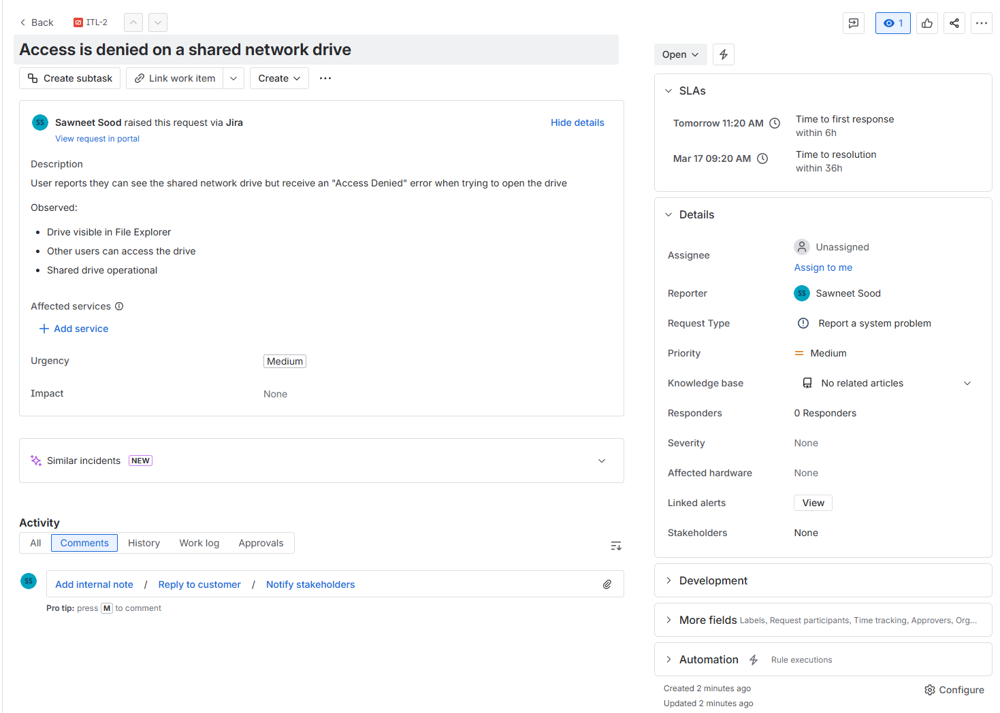
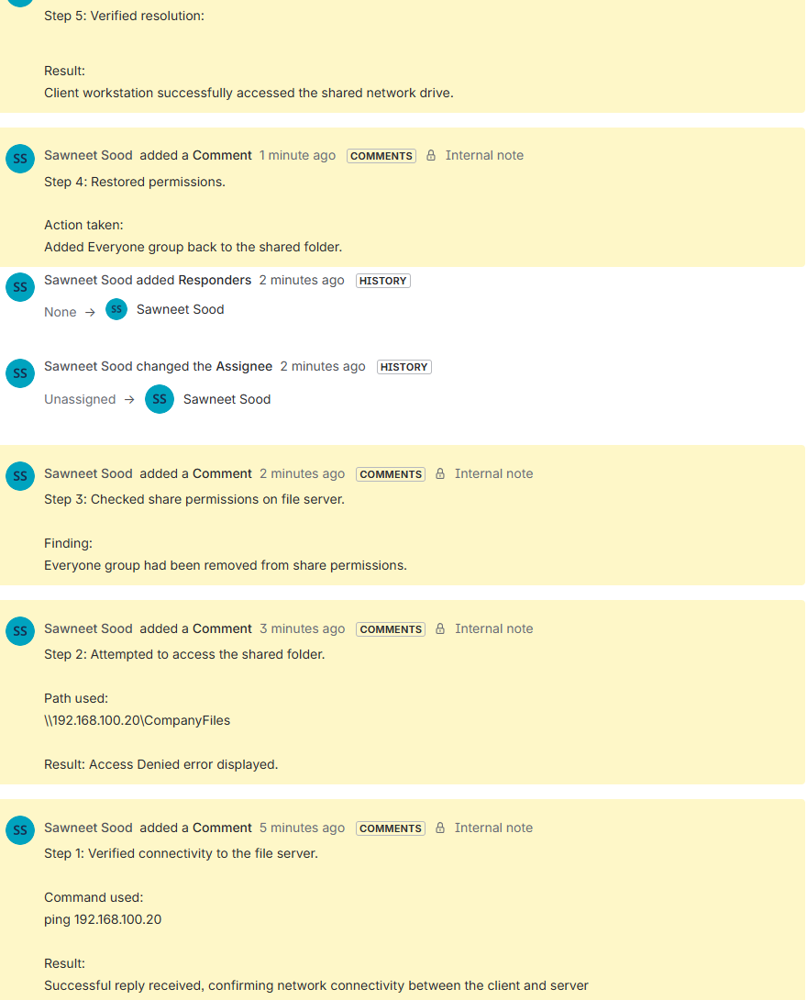
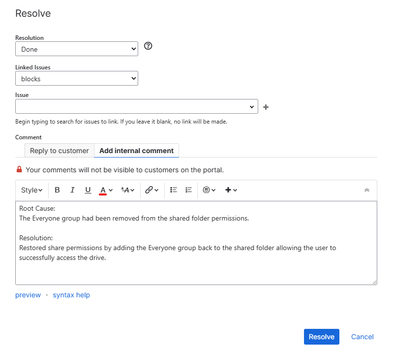
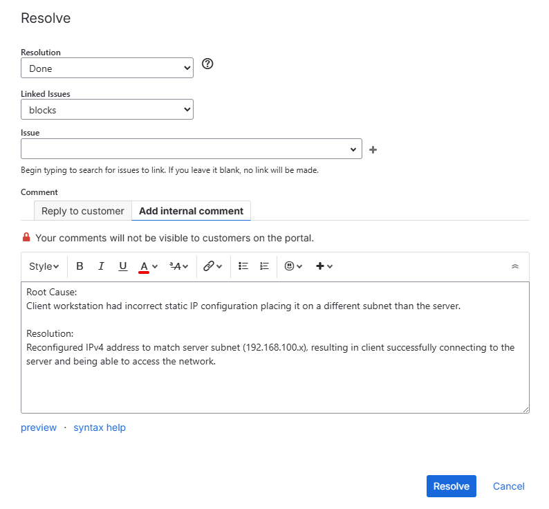
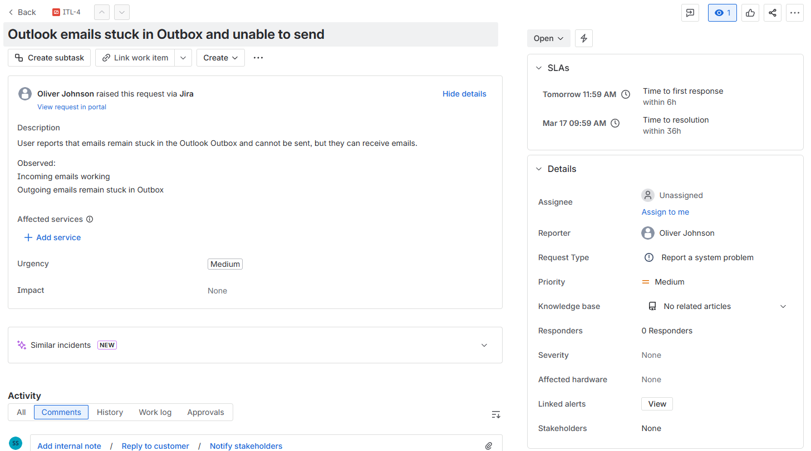
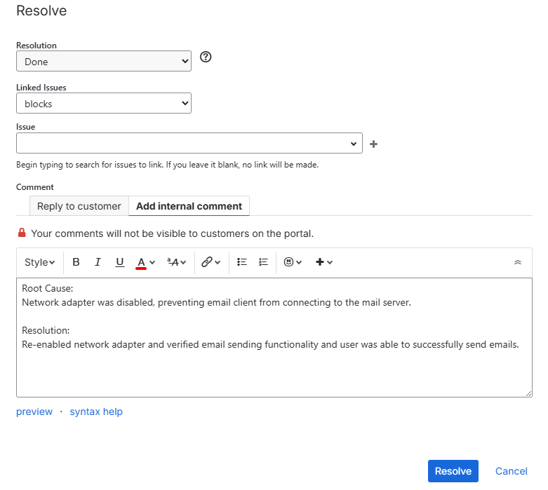

# Ticketing System Simulation Lab

## Overview

This project simulates the workflow of an IT Helpdesk technician using a ticketing system to manage and resolve common user issues.

The goal of this lab was to become familiar with ticketing system software by:

- Creating helpdesk tickets
- Documenting troubleshooting steps through ticket comments
- Resolving tickets using a structured troubleshooting process

This project demonstrates how IT support technicians track incidents, investigate issues, communicate troubleshooting progress, and document resolutions.

---

## Tools and Technologies Used

- **Jira Service Management** (ticketing system)
- **Windows Operating System**
- **Command Line Utilities**
- **Network Troubleshooting Tools**

### Commands Used During Troubleshooting

```
ping
ipconfig
```

---

## Ticket Workflow

Each incident followed a standard helpdesk workflow:

**Ticket Created → Investigation → Troubleshooting/Comments → Resolution → Ticket Closed**

Internal ticket comments were used to:

- Document troubleshooting steps
- Record diagnostic results
- Explain the final resolution

---

# Incident 1 – Network Drive Access Denied

## Scenario

A user reported they could not access the company shared network drive. When attempting to open the shared folder, an **Access Denied** error was displayed.

**Shared Folder**

```
\\192.168.100.20\CompanyFiles
```

---

## Investigation

Connectivity to the file server was verified.

```
ping 192.168.100.20
```

The ping test confirmed the server was reachable.

### Ticket Created



---

## Root Cause

The Everyone group had been removed from the shared folder permissions which prevented users from accessing the network share.

---

## Resolution

The issue was resolved by:

- Restoring the required permissions
- Adding the Everyone group back to the shared folder
- Verifying access from the client workstation

### Troubleshooting Comments



### Ticket Resolved



---

## Outcome

After restoring the correct permissions, the user was able to successfully access the shared network drive.

---

# Incident 2 – Computer Connected to WiFi but No Internet

## Scenario

A user reported their computer was connected to WiFi but could not access the internet.

---

## Investigation

Connectivity to the server was tested.

```
ping 192.168.100.20
```

Result:

```
Destination Host Unreachable
```

The IP configuration of the workstation was then checked.

```
ipconfig
```

Observed configuration:

- IPv4 Address: **192.168.50.10**
- Subnet Mask: **255.255.255.0**
- Default Gateway: **192.168.50.1**

### Ticket Created


---

## Root Cause

The workstation had an incorrect static IP configuration, placing it on the 192.168.50.x network, while the server was located on the 192.168.100.x network preventing communication as they were on different subnets.


---

## Resolution

The workstation network configuration was corrected:

- IP Address: **192.168.100.10**
- Subnet Mask: **255.255.255.0**
- Default Gateway: *(blank)*

Connectivity was tested again.

```
ping 192.168.100.20
```

### Troubleshooting Comments


### Ticket Resolved



---

## Outcome

After correcting the IP configuration, the workstation successfully communicated with the server and accessed network resources.

---

# Incident 3 – Outlook Emails Stuck in Outbox

## Scenario

A user reported that emails were stuck in the Outlook Outbox and could not be sent.

---

## Investigation

A simulated email environment was created where a file representing an email remained stuck in an Outbox folder.

To simulate the issue, the network adapter was disabled, preventing email transmission.

Command used:

```
ipconfig
```

No IPv4 address was present because the network adapter was disabled.

### Ticket Created



---

## Root Cause

The network adapter was disabled, preventing the computer from establishing a network connection required to send emails.

---

## Resolution

The issue was resolved by:

- Re-enabling the network adapter
- Restoring network connectivity
- Simulating successful email delivery by moving the email from Outbox to Sent

### Troubleshooting Comments


### Ticket Resolved



---

## Skills Demonstrated

This project demonstrates several skills relevant to entry-level IT Helpdesk roles:

- IT incident ticket management
- Structured troubleshooting methodology
- Network connectivity diagnostics
- File share permissions troubleshooting
- Documentation of technical issues and resolutions

---

## Key Concepts Practiced

- Incident management workflow
- Creating, managing/commenting and resolving tickets
- Troubleshooting network connectivity issues
- Diagnosing file share permission problems
- Understanding IPv4 addressing and subnetting
- Verifying system functionality after fixes

---

## Purpose of the Lab

The purpose of this project is understand how ticketing systems work and to simulate real world IT helpdesk responsibilities, including:

- Diagnosing user issues
- Documenting troubleshooting steps
- Communicating through ticketing systems
- Resolving incidents using structured workflows

This lab demonstrates practical skills commonly required in entry-level IT Helpdesk and technical support roles.
