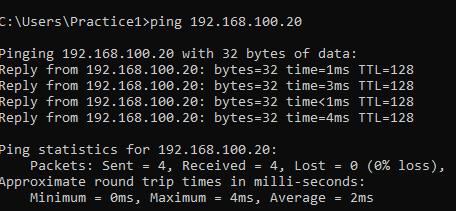
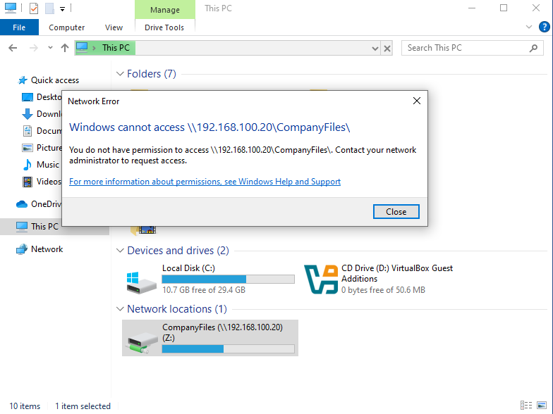
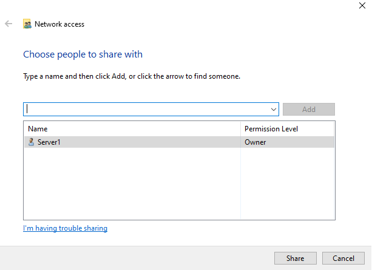
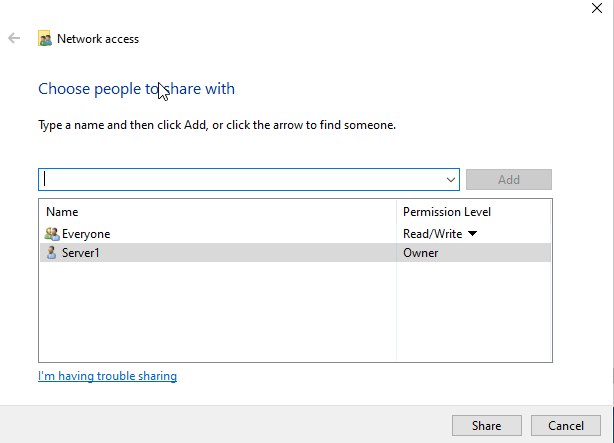
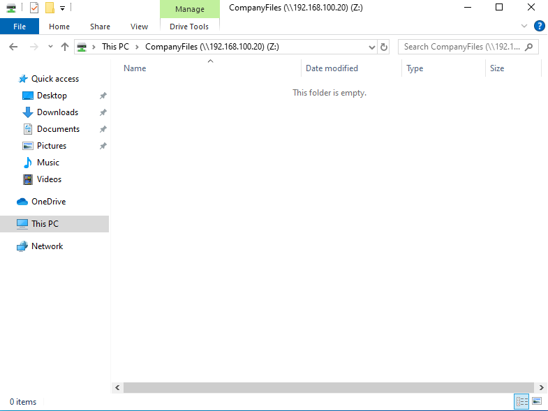

# Lab 1 - Network Drive Access Denied

## Scenario

A user reports they cannot access the company shared network drive. When attempting to open the shared folder, Windows displays an **Access Denied** error.

## Lab Environment

| Device | IP Address | Role |
|------|------|------|
| PC1 | 192.168.100.10 | Client workstation |
| Server | 192.168.100.20 | File server |

Shared Folder:

```
\\192.168.100.20\CompanyFiles
```

## Step 1 – Identify the Problem

The user attempted to access the shared network drive but received an error message.

### Initial Tests

Checked connectivity to the server:

```
ping 192.168.100.20
```

The ping test confirmed that the server was reachable.

Screenshot:



Attempting to access the share caused an error:



---

## Step 2 – Establish a Theory of Probable Cause

Since network connectivity was working, the issue was likely related to:

- Incorrect share permissions
- Logged in as inccorect account

---

## Step 3 – Test the Theory to Determine Cause

On the server, the shared folder permissions were reviewed.

It was discovered that the **Everyone group had been removed from the share permissions**, preventing access.

Screenshot:



---

## Step 4 – Establish a Plan of Action to Resolve the Problem and Implement the Solution

To resolve the issue, the **Everyone group was added back to the shared folder permissions**.

Screenshot:



---

## Step 5 – Verify Full System Functionality and Implement Preventative Measures

After restoring the permissions, the shared folder was accessed again from PC1 and the network drive opened successfully.

Screenshot:



---

## Step 6 – Document Findings, Actions, and Outcomes

### Root Cause

The **Everyone group was removed from the shared folder permissions**, preventing the client workstation from accessing the network share.

### Resolution

Share permissions were restored by adding the **Everyone group with appropriate access rights**.

### Outcome

The client workstation was able to successfully access the network drive.

---

## Skills Demonstrated

- Network troubleshooting
- File sharing configuration
- Permissions troubleshooting

---

