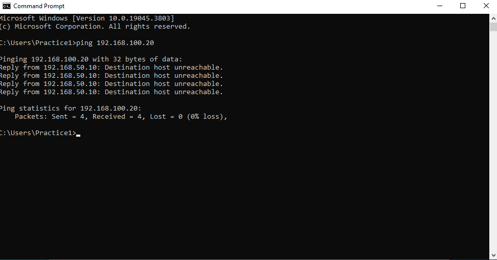
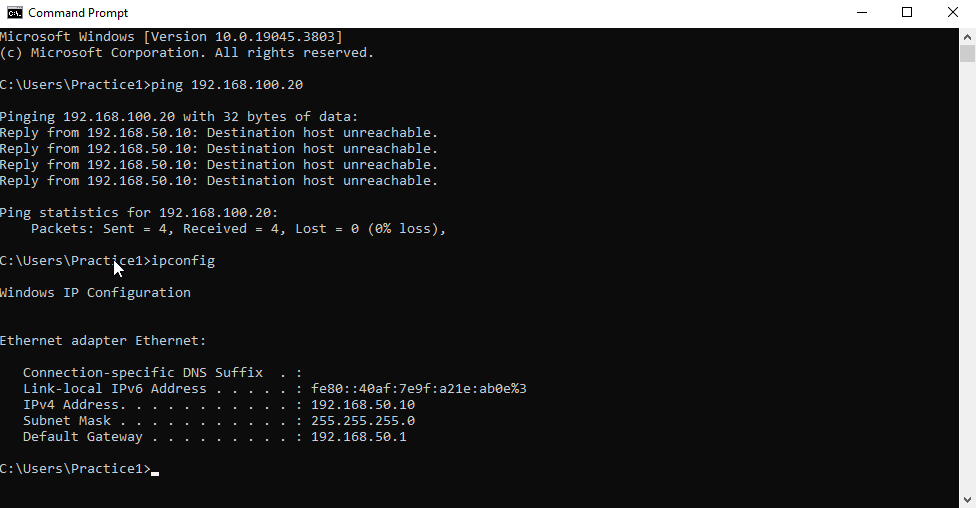
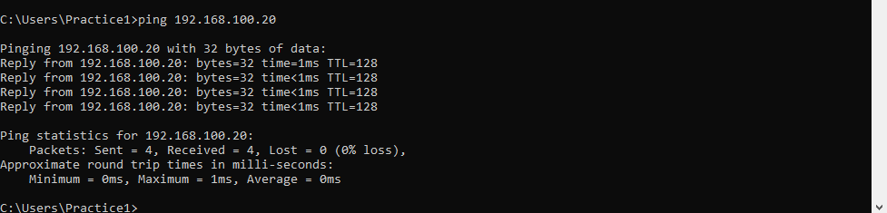

# Lab 2 - Computer Connected to WiFi but No Internet

## Scenario

A user reports that their computer is connected to the network but cannot access the internet or internal resources. Applications fail to load and pinging the server initially fails.

---

## Lab Environment

| Device | IP Address | Role |
|--------|-----------|------|
| PC1 | 192.168.50.10 (incorrect) | Client workstation |
| Server | 192.168.100.20 | File Server |

---

## Step 1 – Identify the Problem

Initial checks on PC1:

- WiFi connected
- Ping to server failed:

```
ping 192.168.100.20
```

Result:

```
Request timed out
```

Screenshot:



---

## Step 2 – Establish a Theory of Probable Cause

Since the client could see the network but could not reach the server:

**Possible causes:**

- Incorrect IP address / subnet
- Wrong default gateway
- DNS misconfiguration
- Firewall blocking traffic

Most likely: **IP address or subnet mismatch preventing proper routing to the server**

---

## Step 3 – Test the Theory

```
ipconfig
```

Observed:

- IPv4 Address: 192.168.50.10
- Subnet Mask: 255.255.255.0
- Default Gateway: 192.168.50.1

**Issue:** PC1 was on the wrong subnet (192.168.50.x), the server was on 192.168.100.x.  

Ping failed because PC1 could not reach the 192.168.100.x network

Screenshot:



---

## Step 4 – Establish a Plan of Action and Implement the Solution

The plan:

Assign a static IP on PC1 in the same subnet as the server:

```
IP Address: 192.168.100.10
Subnet Mask: 255.255.255.0
Default Gateway: Blank
```

Save changes and test connectivity.

---

### Why Ping Was Failing Initially

- PC1’s IP was **192.168.50.10**, subnet mask **255.255.255.0**
- Server’s IP was **192.168.100.20**, subnet mask **255.255.255.0**
- Subnets were different PC1 tried to send packets directly to the server but could not route to a different network because the default gateway was also in the wrong subnet.  
- Result: **“Request timed out”**.

After updating PC1 to **192.168.100.10** with **blank default gateway**:

- PC1 and server were on the same subnet
- Packets could now reach the server directly
- Ping succeeded

---

## Step 5 – Verify Full System Functionality

Ping test after changing IP:

```
ping 192.168.100.20
```

Result:

```
Reply from 192.168.100.20: bytes=32 time<1ms TTL=128
```

Screenshot:



Applications now successfully accessed network resources.

---

## Step 6 – Document Findings, Actions, and Outcomes

### Root Cause

PC1 had an incorrect static IP and default gateway, which placed it on a different subnet than the server. This prevented routing of network packets to the server.

### Resolution

Reconfigured PC1’s IPv4 address and default gateway to match the server’s subnet (192.168.100.x).  

### Outcome

PC1 can now successfully ping the server and access network resources.

---

## Skills Demonstrated

- Understanding IPv4 addressing and subnetting  
- Troubleshooting network connectivity issues  
- Applying static IP and default gateway changes  
- Using ping to verify connectivity
- Using command line command such as ipconfig and ping
---
