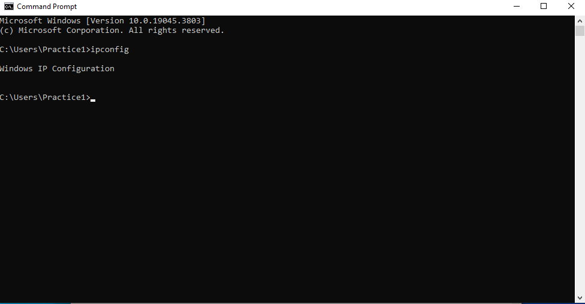
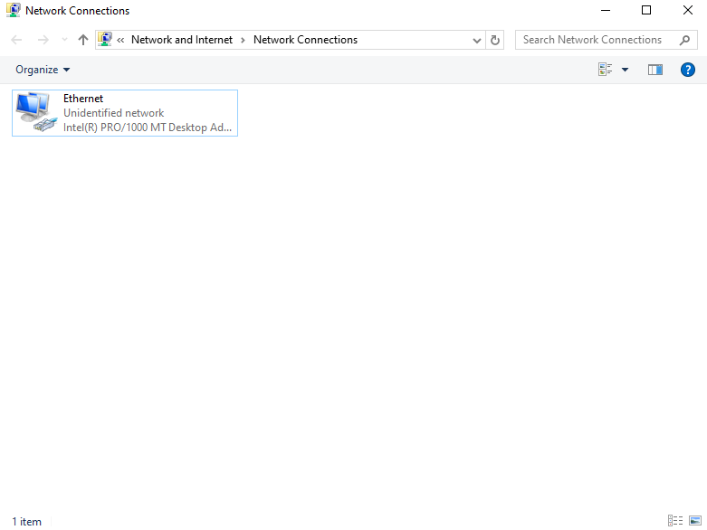
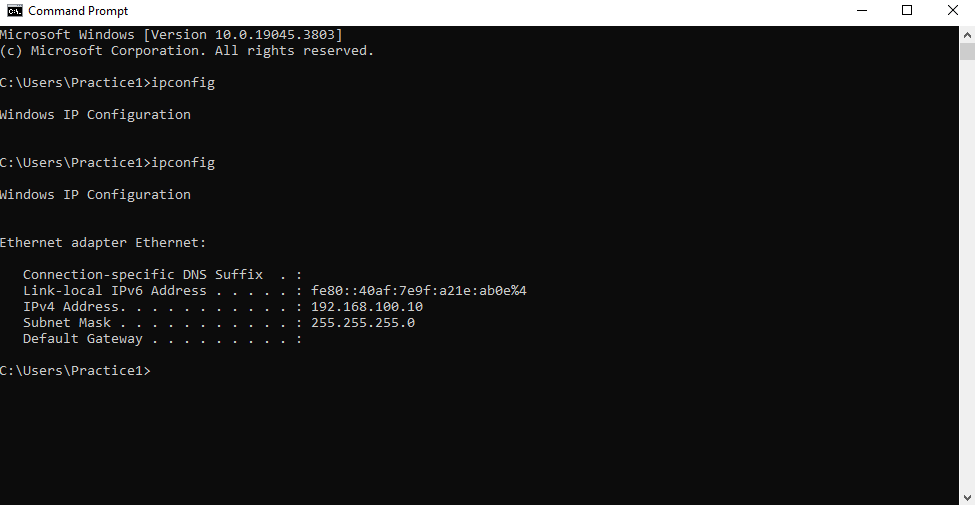

# Lab 3 – Outlook Emails Stuck in Outbox

## Scenario

A user reports that they are unable to send emails in Outlook. Messages remain stuck in the Outbox and are not being delivered.

---

## Lab Environment

| Device | IP Address | Role |
|--------|-----------|------|
| PC1 | 192.168.100.10 | Client workstation |

---

## Step 1 – Create Outbox and Dummy Email

- Created folder `Outbox`
- Added file `Email.txt` to represent a stuck email

Screenshot:

---

## Step 2 – Break Network Connectivity

To simulate a connectivity issue:

- Disabled the network adapter in Windows settings
- Ran the command `ipconfig`

Because the adapter was disabled, no IPv4 address was displayed.

Screenshot:

---

## Step 3 – Verify Email Cannot Be Sent

- `Email.txt` remained in the `Outbox` folder
- This demonstrates that emails cannot be sent while the computer has no network connectivity

---

## Step 4 – Fix the Issue

To restore connectivity:

- Re-enabled the network adapter
- Confirmed the system received a valid network configuration

Simulated sending the email by moving `Email.txt` from the `Outbox` folder to the `Sent` folder.

Screenshot:

---

## Step 5 – Verify Full Functionality

- Created an additional dummy email and moved it to the `Sent` folder
- Outbox cleared and emails were successfully "sent"

---

## Step 6 – Document Findings

**Root Cause:** Network adapter disabled resulted in no network connectivity, preventing emails from being sent.

**Resolution:** Re-enabled the network adapter and verified the system obtained a valid IP configuration.

---

## Skills Demonstrated

- Simulated email troubleshooting
- Identifying network connectivity issues
- Using command line tools such as `ipconfig`
- Restoring network adapter connectivity
