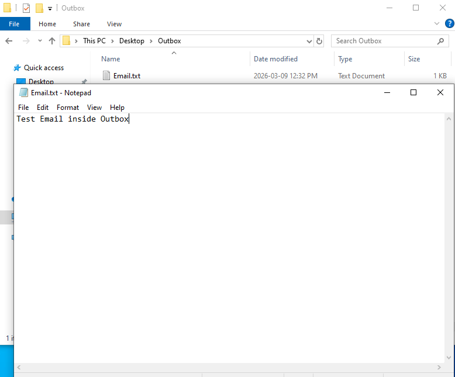
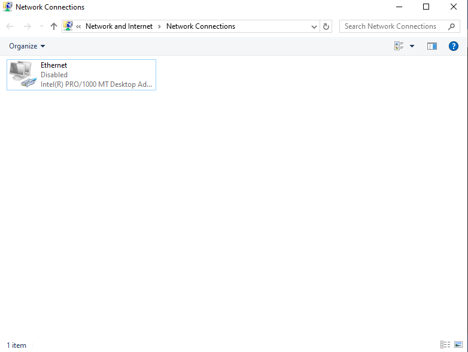
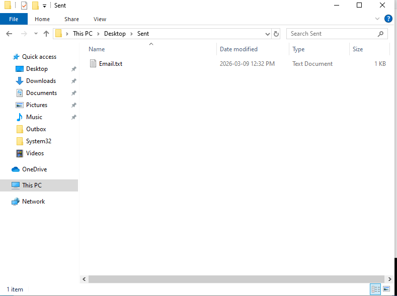

# Lab 3 – Outlook Emails Stuck in Outbox  

## Scenario

A user reports that they are unable to send emails. Outgoing emails remain stuck in the Outbox while incoming emails are unaffected.

---

## Lab Environment

| Device | IP Address | Role |
|--------|-----------|------|
| PC1 | 192.168.100.10 | Client workstation |

---

## Step 1 – Create Outbox and Dummy Email

- Created folder `Outbox`  
- Added file `Email.txt` to represent a stuck email  

Screenshot:

---

## Step 2 – Break Network Connectivity

- Disabled network adapter in settings 
- Ran `ipconfig` resulting in no IPv4 shown  

Screenshot:

  
IP Config: `IPConfigDisabled.png`

---

## Step 3 – Verify Email Stuck

- `Email.txt` remained in `Outbox`  
- Demonstrates email cannot be sent while offline  

---

## Step 4 – Fix

- Re-enabled network adapter  
- Simulated sending email: moved `Email.txt` to `Sent` folder  

Screenshot:

  
Network adapter enabled: `AdapterEnabled.png`  
IP Config: `IPConfigEnabled.png`  

---

## Step 5 – Verify Full Functionality

- Created additional dummy email → moved to Sent  
- Outbox cleared, emails “sent” successfully  

---

## Step 6 – Document Findings

**Root Cause:** Network adapter disabled resulted in no connectivity  
**Resolution:** Re-enabled adapter and sent email  
**Outcome:** Outbox cleared and emails successfully sent

---

## Skills Demonstrated

- Simulated email troubleshooting  
- Understanding network adapter impact on sending  
